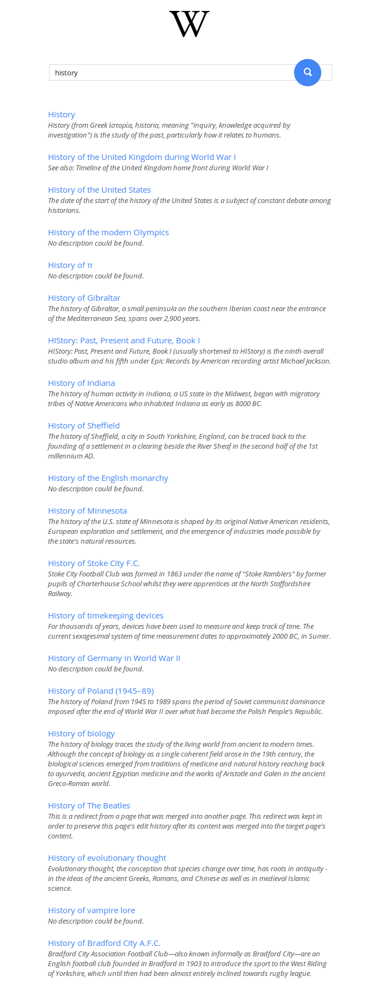

Welcome!

The project is a simple Wikipedia search engine. It searches for a given keyword via Wikipedia's API

This was build to complete a [FreeCodeCamp challenge](http://www.freecodecamp.com/challenges/build-a-wikipedia-viewer). You can use the code as you see fit, just don't use my personal name (scrub it out). See [license](./license.md).

## Features

- Responsive

- Clean interface

- In accordance with Wikipedia's API Etiquette

## Screenshot

## Dependencies

This project uses gulp as it's task runner hence it needs [node.js](https://nodejs.org) to run.

For the rest of the npm packages that it depends on, see [package.json](./package.json#L12).

### Node.js Linux Install

To install node on your system, run the following commands: (use `setup_4.x` for version 4.x.x of node or `setup_5.x` for version 5.x.x)

	curl -sL https://deb.nodesource.com/setup_4.x | sudo -E bash -
	sudo apt-get install -y nodejs

Install the build tools (you may already have them):

	sudo apt-get install -y build-essential

Link the `nodejs` binary to the `node` or else you will run into problems along the way (because there is another node package - Amateur Packet Radio "Node" Program - that is going to screw with your setup):

	sudo ln -s /usr/bin/nodejs /usr/bin/node

### Install Node.js on other platforms

See the [official node install guide](https://nodejs.org/en/download/package-manager).

## Getting started

Install the dev dependency packages:

	npm install -d

### Run the dev build

To start working in dev mode, just run:

	npm run dev

*NOTE*: This mode includes a built in webserver (gulp-connect), along with livereload (inserted automagically into your file), and file watchers.

Just run it and start building away.

### Run the prod build

The production build minifies files, end sends `NODE_ENV=prod` to libraries that might care. (at the moment of writing this, none did).

This is a one time build (unlike the `dev` build), and will exit once it's done with the `Production build completed successfully` message.

## Cleanup

**Do NOT** store files in `./scripts`, `./media`, `./styles` as these will be deleted / recreated when running any build (`dev` or `prod`), all files **must go** in the subfolders of `./sources`.

## License

This project is licensed under the Mozilla Public License Version 2.0. You can [read it here](./license.md) or [learn more about it here](http://choosealicense.com/licenses/mpl-2.0/).

### Additional licenses

This project uses additional libraries, each with it's own license:

- `jquery` - [Copyright jQuery Foundation and other contributors](https://github.com/jquery/jquery/blob/master/LICENSE.txt)

#### Icons

This project uses icons by [Pham Thi Dieu Linh](https://thenounproject.com/phdieuli/)
